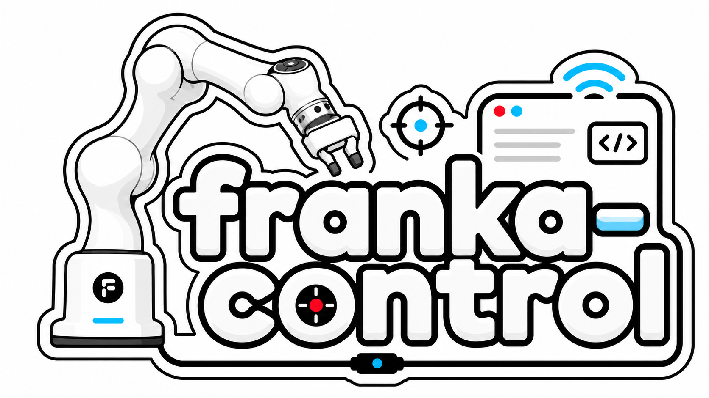
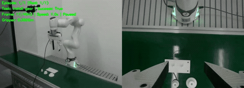
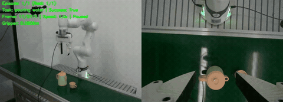
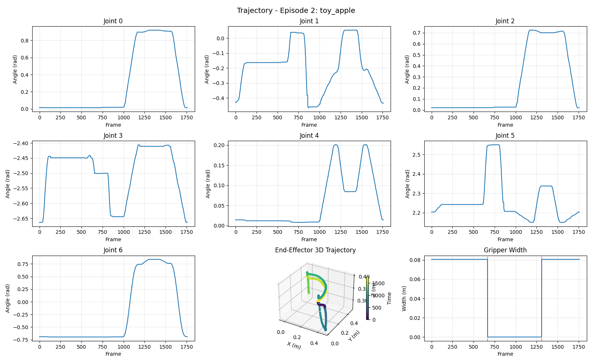
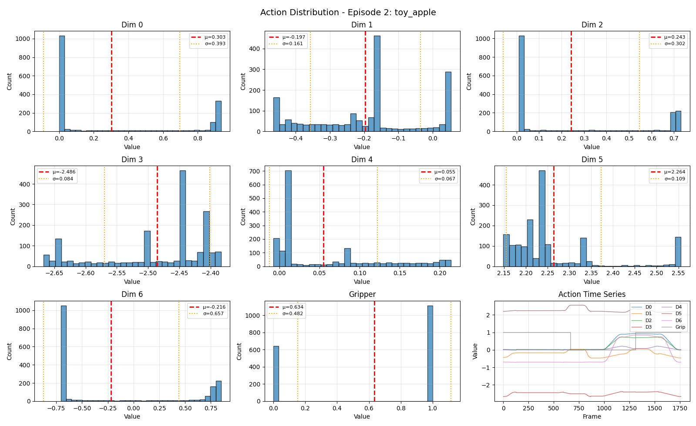
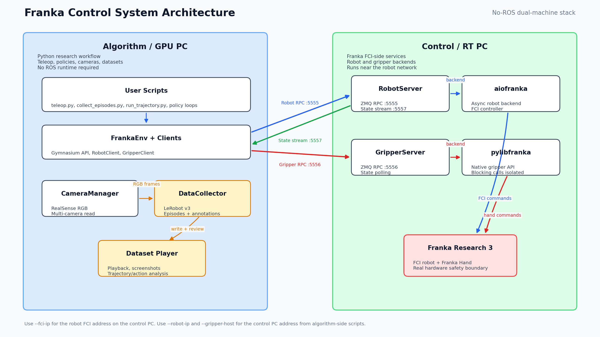

<p align="center">
  
</p>

# Franka Control

[](https://github.com/ArrebolBlack/franka-control/actions/workflows/ci.yml)

No-ROS, Python-native control and data collection toolkit for Franka Research 3.

Franka Control is designed for embodied AI, imitation learning, reinforcement learning,
teleoperation, motion planning, and robotics/control research on real Franka hardware.
It provides a lightweight dual-machine stack with fast ZMQ state streaming, a Gymnasium
environment, SpaceMouse/keyboard teleoperation, waypoint and TOPPRA trajectory tools,
Pinocchio FK/IK, RealSense camera integration, and LeRobot v3 dataset collection.

> `v0.1.0` released. Hardware control always requires careful validation on
> your robot and network setup.

## Why This Project

Most Franka software stacks are either ROS-centered or narrowly focused on one layer of
the robotics pipeline. This project aims to provide a complete, lightweight Python stack:

- No ROS runtime dependency.
- Dual-machine architecture for a real-time control PC plus an algorithm/GPU machine.
- High-frequency robot state streaming over ZMQ.
- Gymnasium-compatible `FrankaEnv` for policies and RL-style loops.
- SpaceMouse and keyboard teleoperation.
- Waypoint capture, route editing, TOPPRA trajectory planning and execution.
- Pinocchio-based FK/IK utilities.
- Multi-RealSense camera support.
- LeRobot v3 embodied dataset collection, resume, annotation, playback and analysis.

## Relationship to ROS, franka_ros, libfranka, and LeRobot

Franka Control is not a ROS wrapper and does not require `roscore`, ROS messages, ROS
controllers, or MoveIt at runtime.

| Stack | Role |
|---|---|
| `franka_ros` / ROS 2 stacks | Full ROS ecosystem integration, MoveIt, ROS tooling. Use these if your system is ROS-native. |
| `libfranka` / `pylibfranka` | Low-level Franka C++/Python FCI bindings. This project uses `pylibfranka` for gripper service on the control machine. |
| `aiofranka` | Low-level async robot controller. This project wraps it behind `RobotServer` so the algorithm machine does not need FCI libraries. |
| `LeRobot` | Dataset format and tooling. This project records real Franka demonstrations into LeRobot v3 format. |
| Franka Control | Python-native no-ROS stack for teleop, control, planning, data collection, and learning research. |

This project complements ROS-based stacks. It is best suited when you want a small
Python API, rapid embodied AI iteration, and direct integration with learning pipelines.

## Demos and Screenshots

Compact GIF previews are embedded for quick scanning. Each preview links to the
higher-quality MP4 recording.

<table>
  <tr>
    <td width="50%" valign="top">
      <strong>Keyboard teleoperation: gear insertion</strong><br>
      <a href="docs/assets/keyboard-teleop-install-gear.mp4">
        
      </a><br>
      <a href="docs/assets/keyboard-teleop-install-gear.mp4">Full video (MP4)</a>
    </td>
    <td width="50%" valign="top">
      <strong>SpaceMouse teleoperation: pouring</strong><br>
      <a href="docs/assets/spacemouse-teleop-pouring.mp4">
        
      </a><br>
      <a href="docs/assets/spacemouse-teleop-pouring.mp4">Full video (MP4)</a>
    </td>
  </tr>
  <tr>
    <td colspan="2" valign="top">
      <strong>Dataset playback: fruit basket episode</strong><br>
      <a href="docs/assets/dataset-player-fruit-basket.mp4">
        
      </a><br>
      <a href="docs/assets/dataset-player-fruit-basket.mp4">Full video (MP4)</a>
    </td>
  </tr>
  <tr>
    <td width="50%" valign="top">
      <strong>Trajectory visualization</strong><br>
      <a href="docs/assets/trajectory-analysis.png">
        
      </a>
    </td>
    <td width="50%" valign="top">
      <strong>Action distribution</strong><br>
      <a href="docs/assets/action-distribution.png">
        
      </a>
    </td>
  </tr>
</table>

## Architecture



```text
Algorithm / GPU machine                         Control / RT machine
Python scripts, policies, cameras               Franka FCI connection

FrankaEnv / teleop / collect
RobotClient  ───── ZMQ command :5555 ─────────▶ RobotServer ─▶ aiofranka
state PULL   ◀──── ZMQ stream :5557 ─────────── 1 kHz state polling

GripperClient ──── ZMQ command :5556 ─────────▶ GripperServer ─▶ pylibfranka

CameraManager ─── RealSense RGB frames
StateStreamRecorder ─ robot state + latest camera frames
DataCollector ─── LeRobotDataset v3
```

`RobotClient.set()` is a fire-and-forget latest-command update for control
loops. Other robot commands, including `connect`, `move`, `start`,
`switch_controller`, and `get_state`, use request/response semantics.

Important IP names:

| Name | Meaning |
|---|---|
| FCI IP / `--fci-ip` | Franka robot FCI address, used only by `RobotServer` on the control PC |
| Control PC IP / `--robot-ip` | Network address of the PC running `RobotServer`, used by algorithm-side scripts |
| `--gripper-host` | Gripper service host, usually the same as `--robot-ip` |

## Feature Map

| Feature | Code | Entry point |
|---|---|---|
| Robot service | `franka_control/robot/robot_server.py` | `python -m franka_control.robot` |
| Gripper service | `franka_control/gripper/gripper_server.py` | `python -m franka_control.gripper` |
| Gym environment | `franka_control/envs/franka_env.py` | Python API |
| Teleoperation | `franka_control/scripts/teleop.py` | `python -m franka_control.scripts.teleop` |
| Waypoint capture | `franka_control/scripts/collect_waypoints.py` | `python -m franka_control.scripts.collect_waypoints` |
| Trajectory execution | `franka_control/scripts/run_trajectory.py` | `python -m franka_control.scripts.run_trajectory` |
| Dataset collection | `franka_control/scripts/collect_episodes.py` | `python -m franka_control.scripts.collect_episodes` |
| Dataset player | `scripts/play_dataset.py` | `python scripts/play_dataset.py` |
| Cameras | `franka_control/cameras/camera_manager.py` | Python API / collection script |
| LeRobot writer | `franka_control/data/collector.py` | Python API |
| State recorder | `franka_control/data/state_recorder.py` | Used by `collect_episodes.py` |
| FK/IK | `franka_control/kinematics/ik_solver.py` | Python API |
| Latency measurement | `franka_control/scripts/measure_latency.py` | `python -m franka_control.scripts.measure_latency` |

## Installation

Recommended environment:

- Ubuntu 22.04 or 24.04.
- Python 3.12.
- A desktop session on the algorithm machine if you use OpenCV windows, keyboard
  teleop, or the dataset player.
- PREEMPT_RT, Franka FCI, `aiofranka`, and `pylibfranka` on the control machine.
- For GUI preview and playback, use `opencv-python`. If you intentionally run
  headless servers, use `--display off`; replacing it with `opencv-python-headless`
  disables OpenCV windows and the dataset player GUI.

Algorithm machine:

```bash
git clone https://github.com/ArrebolBlack/franka-control.git
cd franka-control

conda create -n franka python=3.12 -y
conda activate franka

python -m pip install -U pip setuptools wheel
python -m pip install -e ".[dev]"
```

Control machine:

```bash
git clone https://github.com/ArrebolBlack/franka-control.git
cd franka-control

conda create -n franka python=3.12 -y
conda activate franka

python -m pip install -U pip setuptools wheel
python -m pip install -e .
python -m pip install -e ".[control-machine]"
```

If `aiofranka` or `pylibfranka` cannot be installed from pip in your setup, install
them using your local Franka FCI installation procedure.

SpaceMouse on Linux usually needs HID libraries and udev permissions:

```bash
sudo apt install libhidapi-hidraw0 libhidapi-libusb0
sudo tee /etc/udev/rules.d/99-spacemouse.rules > /dev/null <<'RULES'
SUBSYSTEM=="usb", ATTRS{idVendor}=="256f", MODE="0666"
SUBSYSTEM=="hidraw", ATTRS{idVendor}=="256f", MODE="0666"
RULES
sudo udevadm control --reload-rules
sudo udevadm trigger
```

Run tests:

```bash
python -m pytest tests -q
```

## Quick Start

Assume:

- Franka FCI IP: `192.168.0.2`
- Control PC IP: `192.168.0.100`
- Algorithm PC IP: `192.168.0.200`

1. Start robot service on the control PC:

```bash
python -m franka_control.robot \
    --fci-ip 192.168.0.2 \
    --port 5555 \
    --state-stream-port 5557 \
    --poll-hz 1000
```

2. Start gripper service on the control PC:

```bash
python -m franka_control.gripper \
    --robot-ip 192.168.0.2 \
    --port 5556
```

3. Verify network latency from the algorithm PC:

```bash
python -m franka_control.scripts.measure_latency \
    --robot-ip 192.168.0.100 \
    -n 100
```

4. Run low-speed teleoperation:

```bash
python -m franka_control.scripts.teleop \
    --robot-ip 192.168.0.100 \
    --gripper-host 192.168.0.100 \
    --device spacemouse \
    --action-scale-t 0.5 \
    --action-scale-r 1.0 \
    --hz 50
```

5. Collect demonstrations:

```bash
python -m franka_control.scripts.collect_episodes \
    --robot-ip 192.168.0.100 \
    --gripper-host 192.168.0.100 \
    --repo-id user/franka_pick \
    --root data/franka_pick \
    --task-name "pick red cube" \
    --device spacemouse \
    --control-mode ee_delta \
    --action-scale-t 0.5 \
    --action-scale-r 1.0 \
    --fps 30 \
    --num-episodes 50 \
    --cameras config/cameras.yaml \
    --display auto
```

6. Inspect the dataset:

```bash
python scripts/play_dataset.py \
    --repo-id user/franka_pick \
    --root data/franka_pick
```

For the full workflow, see [`docs/quickstart.md`](docs/quickstart.md).

## Dataset Format

The collector writes LeRobot v3 datasets. Default features:

| Key | Shape | Description |
|---|---:|---|
| `observation.state` | `(8,)` | `q0..q6 + gripper_width` |
| `observation.joint_vel` | `(7,)` | Joint velocities |
| `observation.ee_pose` | `(7,)` | `x,y,z,qx,qy,qz,qw` in SciPy `xyzw` order |
| `observation.effort` | `(7,)` | Joint torques |
| `action` | `(8,)` or `(7,)` | Depends on control mode |
| `observation.images.<camera>` | `(H,W,3)` | RGB camera frame |
| `task` | string | Natural language instruction |

Success/failure annotations are stored in:

```text
<dataset_root>/meta/episode_annotations.json
```

More details: [`docs/data_collection.md`](docs/data_collection.md).

## Python API

```python
import numpy as np
from franka_control.envs import FrankaEnv

env = FrankaEnv(
    robot_ip="192.168.0.100",
    gripper_host="192.168.0.100",
    action_mode="ee_delta",
    gripper_mode="binary",
)

obs, info = env.reset()

# ee_delta: dx, dy, dz, drx, dry, drz, gripper
action = np.array([0.01, 0, 0, 0, 0, 0, 1.0], dtype=np.float32)
obs, reward, terminated, truncated, info = env.step(action)
print(info["applied_action"])

env.close()
```

More API examples: [`docs/api.md`](docs/api.md).

## Documentation

- [Documentation Index](docs/README.md)
- [Quick Start](docs/quickstart.md)
- [Data Collection](docs/data_collection.md)
- [Python API](docs/api.md)
- [No-ROS Design and ROS Comparison](docs/ros_comparison.md)
- [Troubleshooting](docs/troubleshooting.md)
- [Hardware Validation](docs/hardware_validation.md)
- [Media Capture Runbook](docs/media_capture.md)
- [Release Materials Checklist](docs/release_materials_checklist.md)
- [Community Submission Notes](docs/community_submission.md)
- [Roadmap](ROADMAP.md)
- [Changelog](CHANGELOG.md)
- [Chinese README](README.zh-CN.md)

## Safety and Limitations

- This repository controls real robot hardware. Always test with conservative
  velocity, acceleration, and workspace limits.
- `FrankaEnv` does not provide task rewards or episode termination logic.
- The control machine is responsible for real-time FCI-side dependencies.
- The algorithm machine should not be treated as a hard real-time controller.
- The project is not affiliated with or endorsed by Franka Robotics GmbH.

## Citation

If this repository helps your research, please cite it using [`CITATION.cff`](CITATION.cff).

```bibtex
@software{yu_franka_control_2026,
  title = {Franka Control: No-ROS Python Control and Data Collection for Franka Research 3},
  author = {Yu, Yiqi},
  version = {0.1.0},
  year = {2026},
  date = {2026-04-30},
  url = {https://github.com/ArrebolBlack/franka-control}
}
```

## License

This project is released under the Apache License 2.0. See [`LICENSE`](LICENSE).
